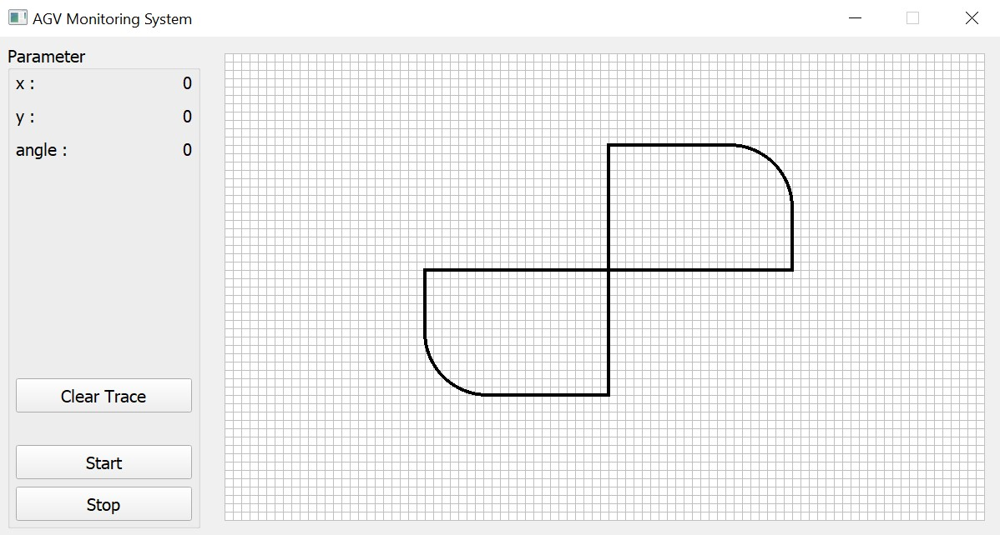
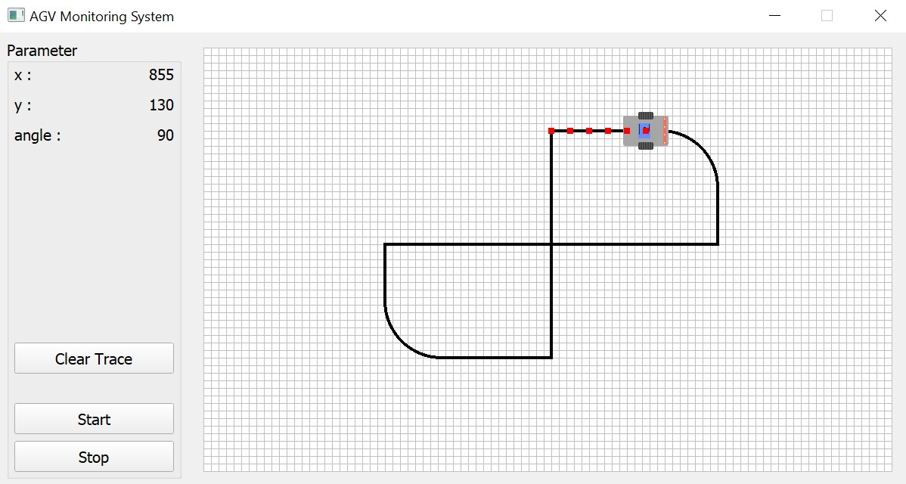

# AGV Monitoring
A desktop software which used to monitor the Automated Guided Vehicle (AGV) movement.
## Table of Contents
* [General Information](#general-information)
* [Library Used](#library-used)
* [Display](#display)
## General Information
Part of a Proyek Mandiri Lintas Disiplin Ilmu (PMLDI) course supervised by Mr. Fakih Irsyadi, S.T., M.T. The project aim is to monitor the Automated Guided Vehicle (AGV) robot movement by getting the x-axis and y-axis movement value and rotation value from Firebase Realtime Database then transform it into vertical and horizontal movement on computer display. The software is totally developed by using Python programming language.
## Library Used
The library used in this project are listed below:
* PyQt5, framework for developing graphical user interfaces (GUIs).
* pyrebase, Python library that serves as a Python interface for the Firebase platform.
## Display

